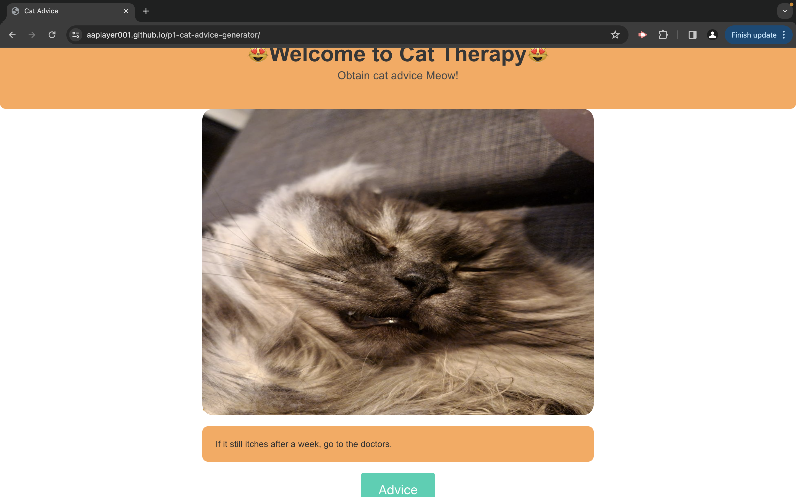

# Cat Therapy

## Overview

Welcome to Cat Therapy, a web page that combines cat pictures with useful advice.

## Features

- **Cat Advice:** Get random cat advice with a click.
- **Cat Images:** Fetches random cat pictures to soothen your mood.
- **User-friendly:** Simple interface for a good user experience.

## Technologies

- **HTML, CSS, JS:** Basic web technologies.
- **Bulma CSS:** Styling.
- **Adviceslip API:** Random advice.
- **Cataas API:** Random cat images.

## Project Files

- **index.html:** Web page structure.
- **style.css:** Styling.
- **script.js:** Content and API requests.

## Functions

- **isAdviceStored:** Checks for duplicate advice.
- **getNewAdvice:** Fetches new advice.
- **getAdvice:** Gets random cat advice.
- **getCatImage:** Fetches random cat image.

## License

This project is under the [MIT License](LICENSE).

**Cat Advice - 2024. All rights reserved.** 🐾

https://aaplayer001.github.io/p1-cat-advice-generator/
